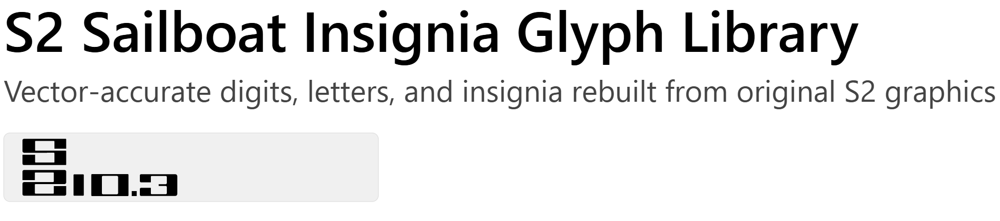

  

S2 Sailboat Insignia Glyph Library
==================================

This project contains a complete set of vector glyphs based on the
original S2 Yachts insignia style. These shapes were manually traced,
measured, and normalized to allow accurate reproduction of S2 hull and
sail numbers such as “S2 10.3”.

Included Glyphs
---------------
Digits: 0–9
Letters: S, A, C
Symbol: decimal point

Formats Provided
----------------
- Individual SVG glyphs
- A combined glyph library (S2_glyph_library.svg)
- A print-ready “S2 10.3” PDF
- ZIP archive containing the full vector set

Purpose
-------
These glyphs allow consistent, accurate reproduction of S2-style
numerals and markings. They can be used for:

- Sail numbers
- Hull graphics
- Documentation or restoration projects
- Digital reproductions of S2 insignia

Technical Notes
---------------
The main SVG library defines each glyph as an SVG <symbol>. Glyphs may
be assembled into numbers by referencing them with <use> elements and
adjusting horizontal spacing. All glyphs share a consistent baseline and
proportional height.

The print-ready PDF uses flattened vector shapes suitable for loft
printing, digital plotting, or conversion to other formats such as DXF.

Limitations
-----------
S2_glyph_library.svg is designed for SVG-aware environments. Programs
that do not support <symbol> and <use> (for example, Microsoft Visio)
may not display the glyphs correctly unless they are flattened.

License
-------
This project is released under the MIT License. See the LICENSE file for
details.

Author
------
Robert D. Hunkins
